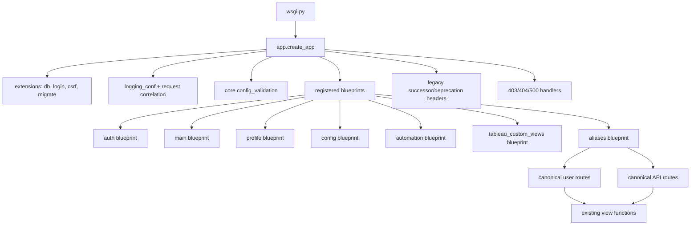
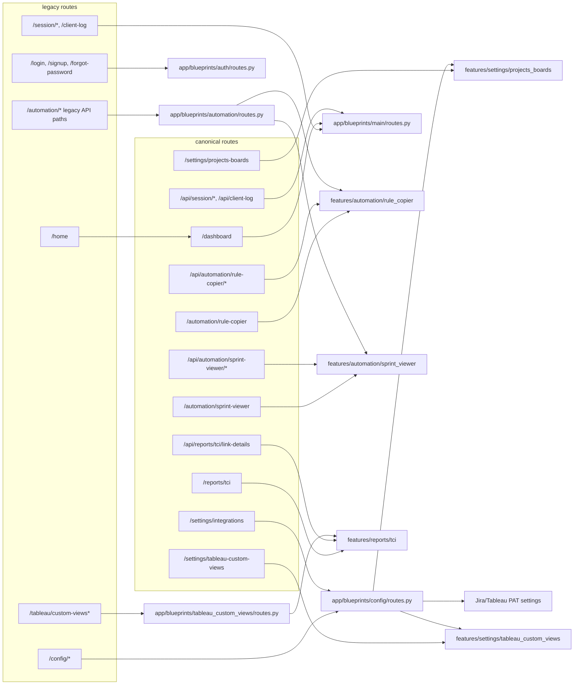
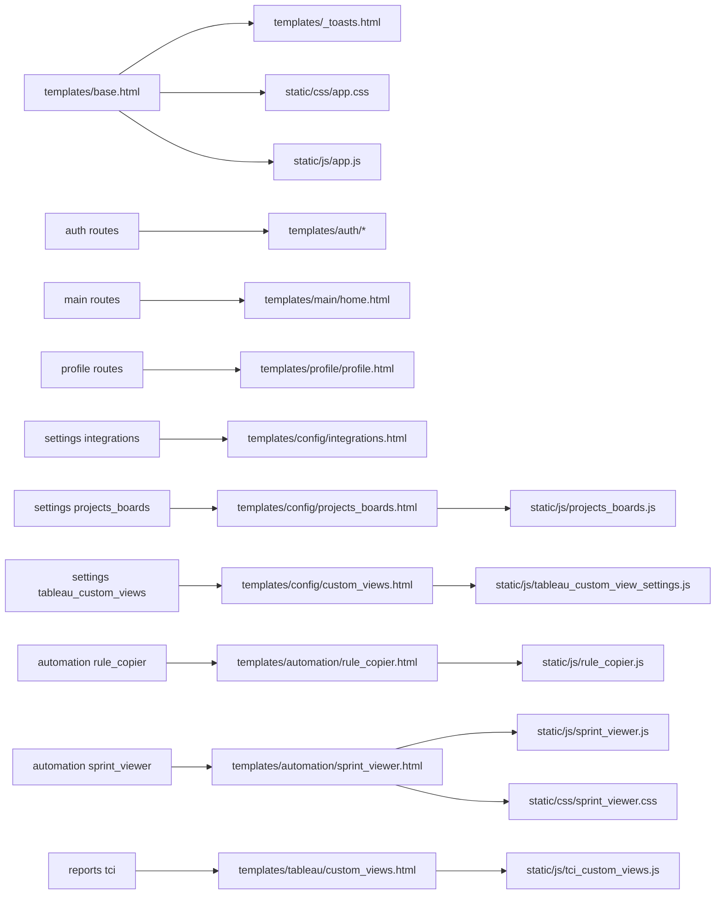

# Code Review Graph

Use this as the review map for changes in this project. Start at the edited
node, then follow outgoing edges to identify behavior, data, tests, and routes
that should be checked.

## Review Order

1. App setup and route registration: `app/__init__.py`, `app/blueprints/**`.
2. Compatibility aliases: `app/blueprints/aliases/routes.py`.
3. Feature handlers: `app/features/**/routes.py` and adjacent forms.
4. Shared infrastructure: `app/core/**`, `app/extensions.py`, `app/logging_conf.py`.
5. Services and external API clients: `app/services/**`.
6. Persistence model and migrations: `app/models.py`, `migrations/versions/**`.
7. Templates and static assets: `app/templates/**`, `app/static/**`.
8. Focused tests for touched nodes, then route/session smoke coverage.

## Runtime Graph

## Route And Feature Graph

## Service And Data Graph

```mermaid
flowchart TD
    subgraph FeatureHandlers["feature and blueprint handlers"]
        Auth["auth routes"]
        Integrations["settings integrations"]
        Projects["settings projects_boards"]
        TableauSettings["settings tableau_custom_views"]
        RuleCopier["automation rule_copier"]
        SprintViewer["automation sprint_viewer"]
        TCI["reports tci"]
    end

    subgraph Core["shared core"]
        Dependencies["core.dependencies factories"]
        JsonApi["core.api json_ok/json_error"]
        ErrorLogging["core.error_logging"]
        HttpClient["core.http_client.ExternalHttpClient"]
        PatCache["core.jira_pat_validation"]
        DB["extensions.db"]
    end

    subgraph Services["services"]
        Crypto["CryptoService"]
        Jira["JiraService"]
        JiraProjects["JiraProjectsService"]
        RuleSvc["RuleCopierService"]
        SprintSvc["SprintViewerService"]
        TableauSvc["TableauService"]
        JiraLinks["JiraIssueLinksService"]
        ProfileSvc["ProfileService"]
    end

    subgraph Models["models"]
        User["User"]
        UserProject["UserProject"]
        UserBoard["UserBoard"]
        UserBoardSprint["UserBoardSprint"]
        UserTableauCustomView["UserTableauCustomView"]
    end

    Dependencies --> Crypto
    Dependencies --> Jira
    Dependencies --> JiraProjects
    Dependencies --> RuleSvc
    Dependencies --> SprintSvc
    Dependencies --> TableauSvc
    Dependencies --> JiraLinks

    Jira --> HttpClient
    JiraProjects --> HttpClient
    RuleSvc --> HttpClient
    SprintSvc --> HttpClient
    TableauSvc --> HttpClient
    JiraLinks --> HttpClient

    Auth --> Jira
    Auth --> Crypto
    Integrations --> Jira
    Integrations --> TableauSvc
    Integrations --> Crypto
    Projects --> JiraProjects
    Projects --> ProfileSvc
    TableauSettings --> TableauSvc
    RuleCopier --> RuleSvc
    RuleCopier --> JiraProjects
    RuleCopier --> PatCache
    SprintViewer --> SprintSvc
    SprintViewer --> PatCache
    TCI --> TableauSvc
    TCI --> JiraLinks
    TCI --> PatCache

    Auth --> User
    Integrations --> User
    Projects --> UserProject
    Projects --> UserBoard
    TableauSettings --> UserTableauCustomView
    RuleCopier --> UserProject
    RuleCopier --> UserBoard
    SprintViewer --> UserBoard
    SprintViewer --> UserBoardSprint
    TCI --> UserTableauCustomView

    User --> UserProject
    UserProject --> UserBoard
    UserBoardSprint --> User
    UserTableauCustomView --> User

    RuleCopier --> JsonApi
    SprintViewer --> JsonApi
    TCI --> JsonApi
    Auth --> ErrorLogging
    Integrations --> ErrorLogging
    Projects --> ErrorLogging
    TableauSettings --> ErrorLogging
    RuleCopier --> ErrorLogging
    SprintViewer --> ErrorLogging
    TCI --> ErrorLogging
    Auth --> DB
    Integrations --> DB
    Projects --> DB
    TableauSettings --> DB
    SprintViewer --> DB
```

## Template And Static Asset Graph

## Test Anchor Graph

```mermaid
flowchart TD
    AppFactory["app factory, extensions, config"] --> ConfigTests["test_config_validation.py"]
    AppFactory --> LoggingTests["test_logging_conf.py, test_error_logging.py, test_handled_error_logging.py"]

    Routes["registered routes and aliases"] --> RouteTests["test_route_contract.py"]
    Routes --> SessionTests["test_session_and_navigation.py"]
    Routes --> MigrationTests["test_phase8_canonical_route_migration.py"]

    FeatureBoundaries["feature package exports"] --> BoundaryTests["test_feature_boundaries.py"]
    FeatureBoundaries --> Phase3Tests["test_phase3_shared_core_adoption.py"]
    FeatureBoundaries --> Phase4Tests["test_phase4_frontend_modularization.py"]

    ProjectsFeature["settings projects_boards"] --> ProjectTests["test_project_board_management.py"]
    ProjectsFeature --> PerformanceTests["test_phase7_database_performance.py"]

    RuleFeature["automation rule_copier"] --> RuleTests["test_rule_copier_fallback.py"]
    SprintFeature["automation sprint_viewer"] --> SprintTests["test_sprint_viewer_service.py"]
    TciFeature["reports tci"] --> TciTests["test_tableau_forms.py, test_phase6_feature_routes_and_failures.py"]

    CoreApi["core.api/http_client"] --> CoreTests["test_core_api.py, test_core_http_client.py"]
    JiraServices["Jira services"] --> JiraTests["test_jira_service_http_client.py"]
```

## Review Checklist By Change Type

- Route or URL changes: check aliases, legacy deprecation headers, templates, JS fetch targets, and `test_route_contract.py`.
- Feature handler changes: check auth decorators on wrapper routes, JSON shape, handled logging, model writes, and focused phase tests.
- Service changes: check `ExternalHttpClient` error mapping, sanitized snippets, retry/timeout behavior, and mocked HTTP tests.
- Model or migration changes: check uniqueness/indexes, relationship cascade behavior, migrations, and performance tests.
- Frontend changes: check the owning template, matching static file, canonical route URLs, and session/client logging behavior.
- Credential or PAT changes: check encryption/decryption, identity matching, safe flash messages, and no PAT leakage in logs.
