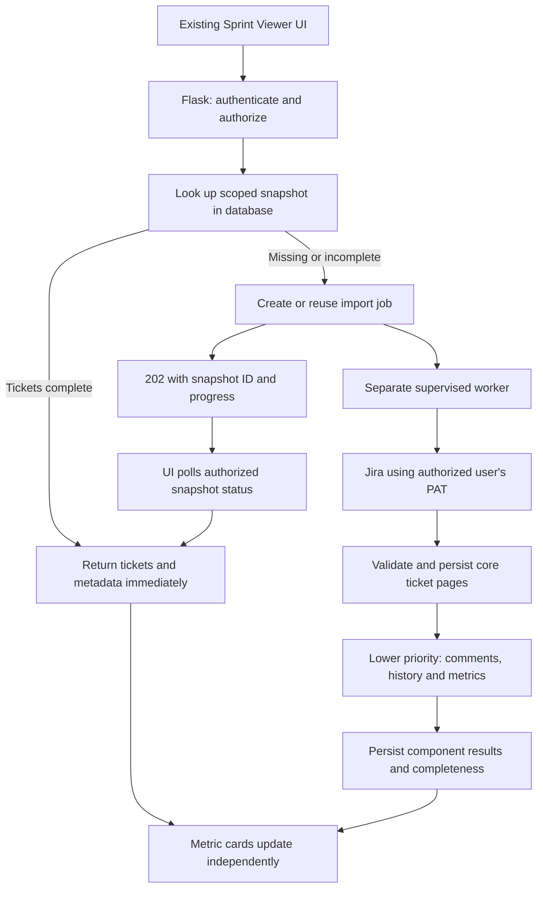

# Sprint Viewer performance and architecture review

Date: 2026-09-09. Scope: current workspace, with Sprint Viewer as the priority and a targeted review of shared infrastructure.

Follow-up decision: the user selected **SQLite only**, mandatory Jira access revalidation, and preservation of existing metric formulas with time-basis labels. The [implementation plan](hardening/README.md) supersedes the tentative PostgreSQL recommendation below; the findings remain the original review record.

Recommendation: retain Flask, Jinja, Bootstrap, and the existing UI. Complete the feature boundaries already started in this project. Introduce durable, access-scoped sprint snapshots and a separately supervised database-backed worker. Prioritize useful ticket data over comment enrichment and expensive metrics. No Redis, Memcached, automatic data expiration, scheduled refresh, framework rewrite, or microservice split is required for the initial implementation.

The requested database-first behavior is feasible. Treat stored results as imported reporting snapshots with explicit completeness and provenance. Folder reorganization alone will not remove Jira latency or the page-wide loading lock.

## Evidence and limits

- Installed the current unpinned requirements into an isolated temporary Python 3.12 environment. Existing suite: **69 passed in 4.31 seconds**, using `python -m pytest -q -p no:cacheprovider`.
- Ran additional synthetic probes against the actual service, route, and migration code. No live Jira requests or production database changes were made.
- The workspace has no Git repository metadata. Production dependency versions, database engine, server configuration, Jira/ScriptRunner versions, response sizes, and live timings are unverified.
- Findings below distinguish code-confirmed behavior from explanations that still need a production trace. No measured speedup is claimed.

## Findings, in implementation priority order

| Priority | Finding and evidence | Recommended change |
| --- | --- | --- |
| P1 | **The UI stays locked after tickets render.** `app/static/js/sprint_viewer.js:806` starts the metrics request, awaits issues, renders tickets, then awaits metrics at line 848. `unlockUi()` only runs afterward in `finally`. | End ticket loading as soon as ticket rendering completes. Keep loading/error/retry state within metric and comment sections. Keep accordion buttons and Jira links usable. |
| P1 | **Ticket loading includes sequential comment requests.** `app/services/sprint_viewer_service.py:256` fetches pages with comments and changelog; line 302 hydrates incomplete comments before proceeding. Lines 338–384 fetch comments issue by issue and page by page. | Move comment hydration off the critical ticket path. Store only required comment identifiers, authors and timestamps; hydrate with bounded concurrency. Keep historical-field completeness explicit. |
| P1 | **Tickets and metrics are never persisted.** `app/features/automation/sprint_viewer/routes.py:295` always fetches issues from Jira; line 417 always calculates metrics against Jira. `app/models.py:131` stores sprint metadata only. | Add persistent ticket/enrichment/metric snapshots with separate readiness states. Read a complete authorized snapshot first; import only missing components. |
| P1 | **Pagination can silently truncate results.** Issue, sprint-list and metric loops stop on `page_count < requested max_results`, even when the server caps page size. Synthetic issue response advertised 3 records, returned 2 with `isLast=false`; the service stopped after one call. Metric probe also returned count 2 and 6 points instead of 3 and 9. | Follow endpoint response pagination metadata, advance by actual returned records, and detect no-progress/inconsistent totals. Do not infer completion from the requested size. Deduplicate by Jira issue ID and reject incomplete imports as complete snapshots. |
| P1 | **Assignee identity is inconsistent.** Current assignees use `name` at service line 393; historical reconstruction uses changelog `from` or display text at line 162. Grouping uses the resulting string unchanged at line 485. A synthetic person with username `E123` and Jira key `JIRAUSER123` produced two groups with the same display name. | Resolve current, historical and comment-author identifiers to one Jira principal ID. Keep verified aliases. Do not merge on display name. |
| P1 | **Historical correctness has gaps.** Null historical assignee values fall back to the current assignee; the probe retained `E999` when the earlier assignee was unassigned. Changelog completeness is not verified, and nonempty partial history is treated as usable. | Preserve null transitions, check history completeness, and expose current/provisional versus sprint-end values. Never label incomplete history as an accurate historical snapshot. |
| P1 | **Five expensive searches run per metric invocation.** Service lines 804–849 issue five ScriptRunner searches with up to five threads per HTTP request. Repeated visitors repeat this work. Parallel requests compete with ticket loading and occupy web workers. | Persist metric inputs/results, deduplicate jobs across processes, and run expensive work in a worker with a Jira-wide concurrency budget and ticket priority. Initially preserve the five query definitions for result parity. |
| P1 | **Selected sprint is not validated against selected board.** The issues route checks a saved board but fetches the supplied sprint ID independently. The synthetic route accepted a saved board plus an unmapped sprint, returning HTTP 200 with blank sprint metadata. | Validate the authorized Jira instance/board/sprint relationship before fetching or serving stored data. This is a missing application scope check; the current Jira request still uses the requesting user's PAT. |
| P1 | **Refresh deletes good data before replacement succeeds.** Sprint-list route lines 153–170 commit deletion before contacting Jira. | Fetch into staging; atomically replace only after complete successful import. Retain the last successful version on failure. Resolve concurrent first-load inserts with uniqueness and conflict handling. |
| P2 | **Services and HTTP sessions are repeatedly constructed for pure calculations.** The issues route calls `_sprint_service()` inside the extraction loop and for each calculation. Probe: 8 service instances for 2 issues; the normal count is N + 6. | Construct one service per request/job and make grouping/aggregation pure functions. Close owned HTTP sessions deterministically and reuse connections within each worker thread. |
| P2 | **Metric threads lose Flask configuration context.** `_new_client()` runs inside executor threads; the HTTP client reads config only if an app context exists. Probe: retry setting 0 in the request became default 3 in a worker. | Resolve an immutable HTTP configuration before launching workers, and inject it explicitly. Add total operation deadlines, connect/read budgets and bounded retry behavior. |
| P2 | **Unnecessary database and browser work.** Sprint page line 78 issues a board query per project despite `UserProject.boards` being select-in loaded. `User.projects` and nested boards are also eagerly loaded during user loading. The accordion builds all ticket rows, including collapsed groups. | Reuse eagerly fetched boards or one explicit query. Make eager loading query-specific. For large sprints, create group headers first and populate rows on expansion or in chunks; exports must still include the full snapshot. Measure before adding virtualization. |

### What “metrics loading multiple times” means in this checkout

There is one `startMetricsRequest()` call per Fetch Issues action. The shared script loader has a set to avoid loading the same feature script twice. No automatic browser retry loop was found. Therefore duplicate frontend invocation is **not established** by the current source review.

There are five distinct server-side metric searches, HTTP retries, and no persistence or in-flight job reuse. Reopening the same sprint therefore repeats computation. Instrument browser request ID, board/sprint, snapshot generation, job ID, metric category, Jira attempt number and endpoint duration to distinguish repeated clicks, retries, concurrent sessions, and distinct searches. Do not infer “duplicate metrics” merely from five Jira search calls.

For duplicate tickets, separately validate repeated issue IDs across pages and stored memberships. Do not deduplicate by summary. The same issue legitimately appearing in different sprint snapshots must remain represented in each.

## Target read and import flow



1. Authenticate the portal user; authorize the saved board, sprint and snapshot scope.
2. Read a compatible complete snapshot component from the database. Zero issues is a valid completed result, not a miss.
3. On a miss, create or reuse one active import job for the same scope and generation. Return a short response with progress, rather than hold a web request open through all Jira work.
4. Worker imports minimal ticket fields and metadata first. A page can be exposed as explicitly partial if progressive ticket display is implemented; never publish page one as the complete sprint.
5. Render ticket groups as soon as usable. Historical assignee/status/point values must either be verified or visibly marked provisional until enrichment completes. This preserves the existing sprint-end meaning instead of silently substituting current values for speed.
6. Worker enriches comments/history and performs remaining metric searches with lower priority. Publish each complete component independently.
7. Subsequent visits read persisted components. Failed or unfinished metrics do not trigger a new ticket import. Normal reads do not refresh data based on age.

The first-ever fetch still depends on Jira latency. The gain on that path comes from reducing prerequisite work and allowing useful partial progress. Repeated reads gain most from persistence.

### Persistence model

Retain existing user, project and board tables. For a modest application, start with snapshot rows and per-issue JSON payloads plus indexed identity/query columns; avoid normalizing every Jira field before it is needed.

| Entity | Key and required information |
| --- | --- |
| `sprint_snapshots` | Internal ID; Jira instance; portal user/access scope; credential/access generation; board ID; sprint ID; snapshot generation; schema version; fetch start/end timestamps; independent core/enrichment/metrics states; expected/received counts; error code; last successful component pointers. |
| `sprint_snapshot_issues` | Unique `(snapshot_id, jira_issue_id)`; issue key, canonical assignee ID, type/subtask flag, status, points, source updated time, extracted payload and historical completeness. Include an assignee lookup index within the snapshot. |
| `jira_principals` and verified aliases | Jira instance + stable principal ID; username/display label; observed username/key aliases. Restrict personal metadata exposure. Unknown aliases remain unresolved until verified. |
| `sprint_metric_inputs` / `sprint_metric_results` | Snapshot generation + metric/category + calculation version; source issue membership and required point values; completion state, computed timestamp and result. Inputs may be compact JSON initially. |
| `sprint_import_jobs` | Snapshot scope/generation/component; queued/running/succeeded/failed state; active-job uniqueness; priority, lease owner/expiry, fencing token, heartbeat, attempt budget and next-attempt time. Store credential references, not plaintext PATs. |

Important invariant: removed-scope tickets may be absent from the sprint issues endpoint. A snapshot containing only that endpoint's current issues is insufficient to reproduce every existing metric. Preserve the ScriptRunner category results and their inputs first. Move calculations entirely into SQL/Python only after parity tests prove the underlying membership and historical point semantics.

The ticket route reconstructs sprint-end points while the metric searches sum the points returned at fetch time. Define whether metrics mean points at sprint start, completion, or fetch time; version this definition. One snapshot generation links components but does not make independent Jira calls an atomic Jira snapshot. Record collection times and detect/reconcile relevant changes during import.

### Worker reliability without an additional cache service

Recommend PostgreSQL for concurrent production web/worker deployment. SQLite can remain useful locally or for a limited single-writer rollout; changing the database engine alone will not make Jira faster.

A PostgreSQL job table can support worker claiming using short transactions with `FOR UPDATE SKIP LOCKED`, a documented queue use case. Commit the claim before Jira I/O. Enforce one active job per scoped component; use leases and fencing so an expired worker cannot overwrite a newer result. Persist pages idempotently, recover abandoned jobs, bound retries, and publish components transactionally. [PostgreSQL locking documentation](https://www.postgresql.org/docs/current/sql-select.html)

Run the worker as a separately supervised process from the same codebase, with graceful shutdown, health checks and queue-depth monitoring. A request-local executor is parallel work inside a web request, not a durable background system. Simply changing Flask handlers to `async def` still occupies a worker; Flask recommends queued work for background tasks. [Flask async documentation](https://flask.palletsprojects.com/en/stable/async-await/)

### API and UI contracts

Preserve existing page URLs, templates, CSS and compatibility wrappers. Adapt existing issues/metrics APIs to return completed data or HTTP 202 with `snapshot_id`, `job_id`, component states, progress and `source`. Add an authenticated status/read endpoint and a CSRF-protected retry action. Keep stored results scoped on every read, status and export request.

Use separate browser states for sprint list, tickets, enrichment, metrics and export. Keep the full-report export disabled until required components are complete. If partial export is later offered, label it explicitly and never replace missing metrics with zero. Metric failure leaves tickets usable and exposes an inline retry.

Carry snapshot generation through responses and reject obsolete results after Start Over or selection changes. Add `AbortController` for superseded browser requests and bounded polling backoff; aborting a browser request does not cancel a worker job. Prevent overlapping requests for the same component and retain server-side job uniqueness for multiple tabs/processes. Announce progress accessibly within the affected section.

### Freshness, deferred as requested

Initial policy: retain successful snapshots until explicit administrative invalidation or an intentionally implemented manual refresh. Existing Refresh Sprints should keep its sprint-list scope unless deliberately relabeled. There is no automatic X-hour/day refresh in the first phase.

Store `fetched_at`, generation and calculation version now. Later, a scheduler can enqueue the same import workflow, rebuild in staging and switch the successful snapshot pointer atomically. Failed refresh retains the last complete generation with an honest timestamp.

Data freshness and authorization freshness are separate. A user's access can be revoked even if reporting data is intentionally static. Initially keep issue-bearing snapshots per user and credential/access generation, invalidate access on PAT changes/account disablement/project removal, and define authorization revalidation for stored reads. Jira PAT identity checks already have a five-minute session reuse window; they do not validate all issue permissions. If Jira must remain the live authorization authority, occasional permission checks may remain necessary even when ticket/metric data comes from the DB. A fully offline read model requires an explicitly managed portal entitlement policy; do not claim indefinite database-only reads automatically preserve Jira revocations.

## Proposed folder structure

```text
app/
  __init__.py                    # application composition
  core/                          # config, HTTP, security, logging, job infrastructure
  integrations/jira/            # transport, pagination, DTOs, principal resolution
  features/automation/sprint_viewer/
    routes.py                    # validation, authorization, response mapping
    schemas.py                   # request/response contracts
    service.py                   # database-first orchestration
    repository.py                # scoped reads and transactional writes
    models.py                    # snapshot/component entities
    calculations.py              # pure, versioned metric calculations
    jobs.py                      # import and enrichment handlers
  templates/automation/sprint_viewer.html
  static/js/sprint_viewer/
    index.js                     # event wiring and state transitions
    api.js
    render.js
    export.js
workers/
  sprint_import_worker.py
migrations/
tests/
  unit/sprint_viewer/
  integration/sprint_viewer/
  browser/sprint_viewer/
  performance/
```

Keep the current JS entry path as a compatibility loader, and temporarily re-export moved Python symbols where necessary. Ensure all feature models are imported for SQLAlchemy/Alembic metadata registration. Shared infrastructure stays in `core`; Jira protocol logic stays in the integration adapter; calculations should not construct HTTP clients or require Flask context. Adopt this structure for Sprint Viewer first, then migrate other features incrementally.

## Production readiness findings beyond Sprint Viewer

| Priority | Evidence | Action |
| --- | --- | --- |
| P1 | `app/config.py:10` falls back to a known development signing secret; startup validation only warns about missing integration URLs. | Fail production startup on missing/default signing secret, invalid encryption key, invalid database configuration or non-HTTPS integration URLs. Keep explicit test/development profiles. |
| P1 | `app/blueprints/auth/routes.py:43` handles login CSRF failure by validating a form with CSRF disabled and logging in. | Remove the bypass. Return a fresh form/token and require resubmission; preserve normal login UX without accepting an unvalidated CSRF request. |
| P1 | First migration `c3d00bc3ae67` alters `user_projects` but never creates it. The documented fresh `flask db upgrade` failed against an empty test DB with `no such table: user_projects`. | Design a tested baseline for empty databases and a compatible upgrade/stamp path for existing databases. Do not rewrite applied migration history blindly. Add migration-from-empty and existing-schema upgrade checks. |
| P1 | `ExternalHttpClient` retries POST by default; Rule Copier creates rules using this client. | Make retry policy operation-specific. Do not blindly retry rule creation after ambiguous responses; require idempotency support or reconcile whether creation succeeded. |
| P2 | `User.active/deleted` are checked during login, while `load_user()` returns the row without those checks. | Enforce disabled/deleted account state on subsequent authenticated requests, including stored data, worker eligibility and exports. Add credential/session revocation behavior. |
| P2 | Quick start ends with `python wsgi.py`, which invokes `app.run`; no production server definition was found. | Add a supervised production WSGI deployment behind TLS. Waitress supports Windows; size web threads, database pool and worker concurrency using measurements. Do not infer the actual deployment uses the development server without checking it. [Flask deployment guidance](https://flask.palletsprojects.com/en/stable/deploying/waitress/) |
| P2 | `requirements.txt` has no version bounds or lock; dev/security tools share the runtime list. | Separate runtime and dev dependencies, lock tested versions with hashes, establish CI tests and vulnerability review. The successful fresh test install is not proof of production dependency equivalence or a vulnerability audit. |
| P2 | Request IDs and total request duration exist, but successful Jira spans/job timings are missing. | Extend existing logging with upstream timings, attempts, pages, bytes, DB query time, worker queue delay and time until tickets become usable. Add login/import rate limits, request limits, backup/restore drills and health/readiness endpoints. Avoid logging raw PATs or full issue/comment bodies. |

Keep existing strengths: the application factory, feature packages, route compatibility wrappers, CSRF protection outside the noted bypass, encrypted PAT storage, secure-cookie defaults, parameterized ORM queries, request correlation, and text-based DOM rendering.

## Rollout and acceptance gates

| Phase | Deliverable | Acceptance evidence |
| --- | --- | --- |
| 0 | Measure present behavior and add regression fixtures for confirmed defects. | Capture representative small/medium/large sprint waterfalls, Jira call counts, unique-user mappings and current metric outputs. Distinguish cold data fetch from repeat visits. |
| 1 | Fix UI lock, pagination, identity resolution, null history, service reuse and HTTP configuration; address critical security and migration findings. | With metrics artificially delayed or failed, loaded tickets remain interactive. Server-capped pages are fully collected. Verified aliases form one group; same-name different principals stay separate. Existing routes and visual layout remain compatible. |
| 2 | Add snapshots, independent component states and safe database-first reads. | A second successful ticket/metric read makes zero Jira **data** requests for completed components. A completed empty sprint remains a hit. Partial imports never masquerade as complete. Users cannot read another scope's data. |
| 3 | Add supervised worker and progressive component loading. | Concurrent same-scope requests reuse one job. Worker crash/restart resumes safely. A lease-expired worker cannot publish. Comments/metrics cannot starve ticket imports. Cancellation and stale response tests pass. |
| 4 | Production rollout and incremental feature organization. | Real PostgreSQL concurrency tests, fresh and upgrade migrations, backup restore, production WSGI smoke test, dependency checks, visual comparison and staged load tests pass. |
| Later | Scheduled freshness using the same worker. | Successful refresh atomically replaces a generation; failures preserve prior data. Revoked access and deleted/restricted issues follow the authorization policy. |

Set performance targets after a baseline: track p50/p95 for ticket readiness, complete metric readiness, DB-hit responses and queue delay separately. Suggested provisional goal for a modest completed snapshot is a sub-second API response and usable tickets within two seconds on the agreed client/network; these are acceptance targets to validate, not predicted results. Cold Jira imports need a separate budget tied to actual Jira performance. Functional correctness and permission isolation are gates before speed targets.

## Remaining deployment facts to establish during implementation

- Actual production database engine, process/thread counts, typical/max sprint size and concurrent viewers.
- Jira Data Center and ScriptRunner versions, actual pagination caps, history availability, custom field IDs and principal alias formats.
- Whether displayed assignees and points must represent sprint start, completion, or current Jira state for each existing metric.
- Whether portal-managed access can authorize stored historical data or live Jira permission checks are required.
- One sanitized example of the reported duplicate group/ticket, to correlate the reproduced identity defect with the production symptom.

The architecture decision can proceed now. These facts tune capacity, historical semantics and access policy; they do not justify delaying the confirmed pagination, UI-lock and identity corrections.
